# Architecture Overview

This document provides a comprehensive overview of the Pacman Sync Utility's system architecture, design principles, and component interactions.

## System Overview

The Pacman Sync Utility is designed as a distributed client-server system that enables synchronized package management across multiple Arch Linux systems. The architecture emphasizes:

- **Scalability**: Support for hundreds of endpoints across multiple pools
- **Reliability**: Fault tolerance and graceful degradation
- **Flexibility**: Support for different deployment scenarios
- **Security**: Authentication, authorization, and secure communication
- **Maintainability**: Clean separation of concerns and modular design

## High-Level Architecture

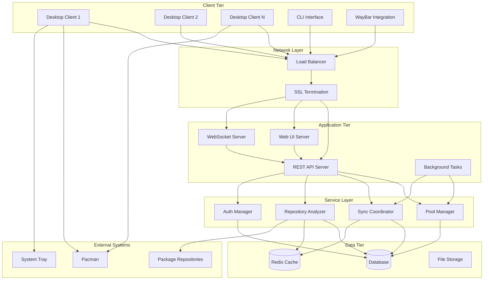

## Component Architecture

### Client Components

#### Desktop Client Architecture

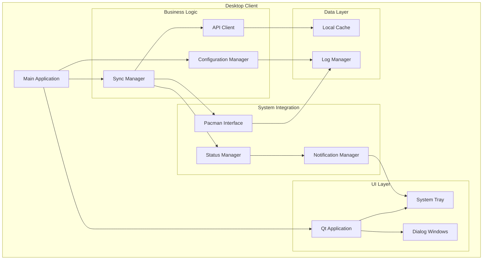

**Key Responsibilities:**
- **Main Application**: Application lifecycle, event loop management
- **UI Layer**: User interface components, system tray integration
- **Business Logic**: Synchronization operations, server communication
- **System Integration**: Pacman integration, system notifications
- **Data Layer**: Local caching, logging, configuration persistence

#### Command Line Interface

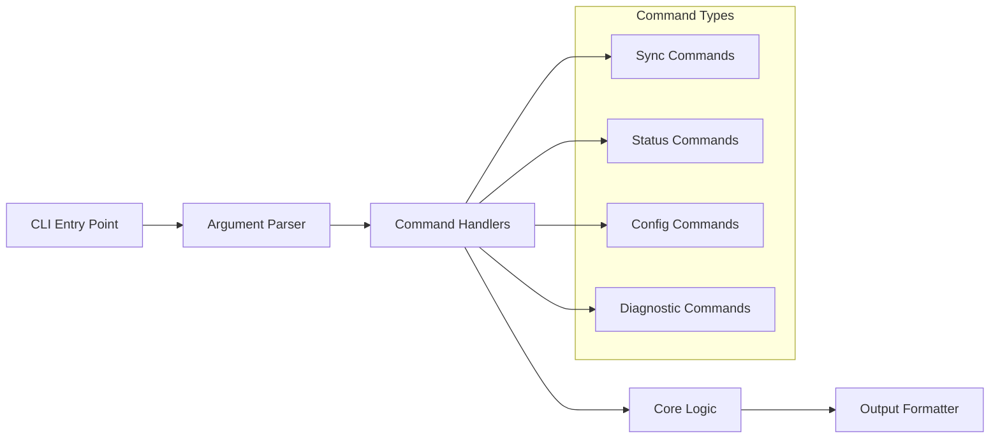

### Server Components

#### Server Architecture

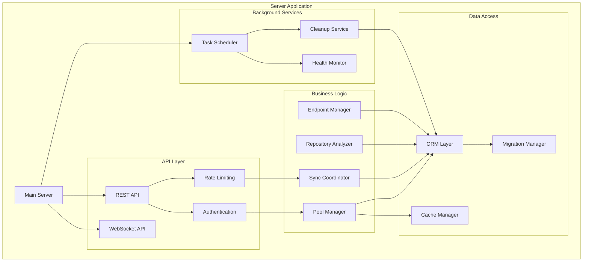

**Key Responsibilities:**
- **API Layer**: HTTP/WebSocket endpoints, authentication, rate limiting
- **Business Logic**: Core domain logic, pool management, synchronization
- **Data Access**: Database operations, caching, migrations
- **Background Services**: Scheduled tasks, cleanup, monitoring

#### Web UI Architecture

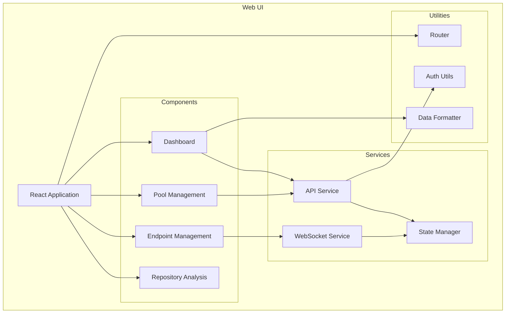

## Data Flow Architecture

### Synchronization Flow

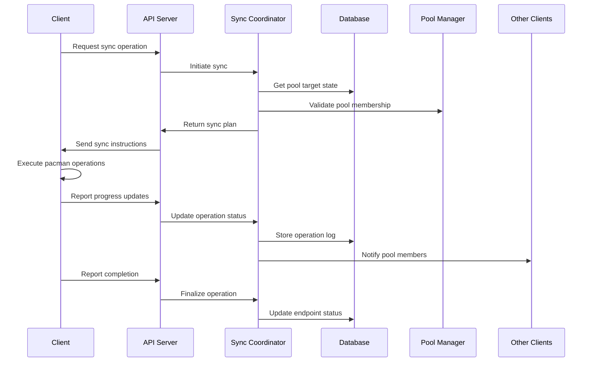

### Repository Analysis Flow

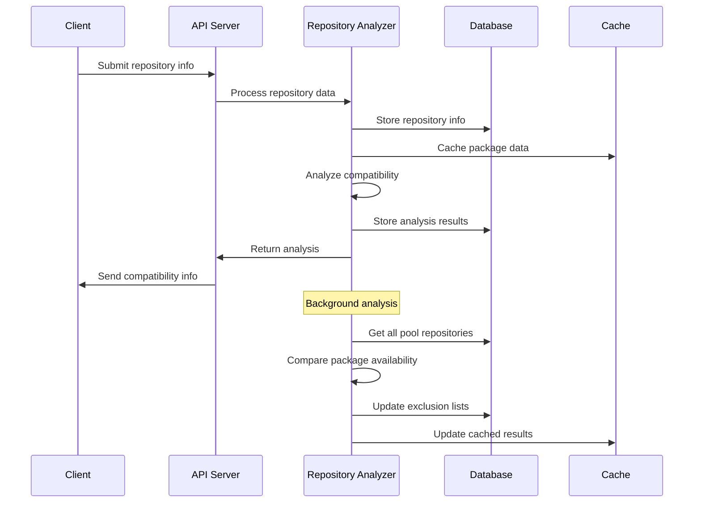

## Security Architecture

### Authentication and Authorization

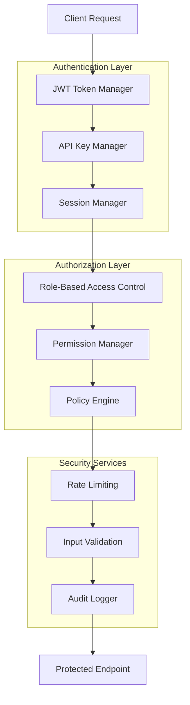

**Security Layers:**
1. **Transport Security**: HTTPS/TLS encryption
2. **Authentication**: JWT tokens and API keys
3. **Authorization**: Role-based access control
4. **Input Validation**: Request sanitization and validation
5. **Rate Limiting**: Protection against abuse
6. **Audit Logging**: Security event tracking

### Data Security

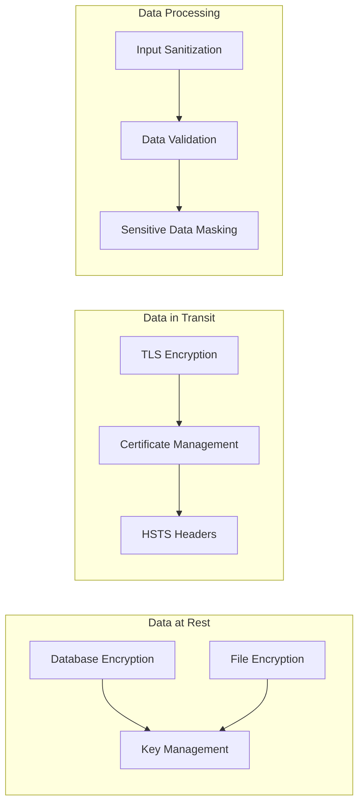

## Scalability Architecture

### Horizontal Scaling

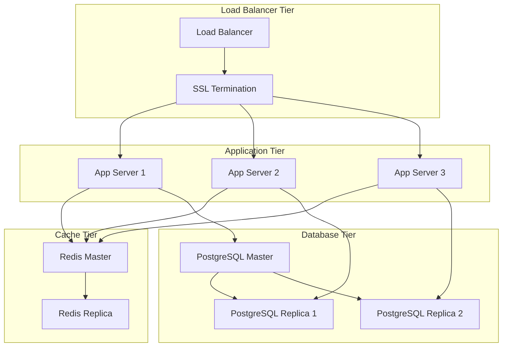

### Performance Optimization

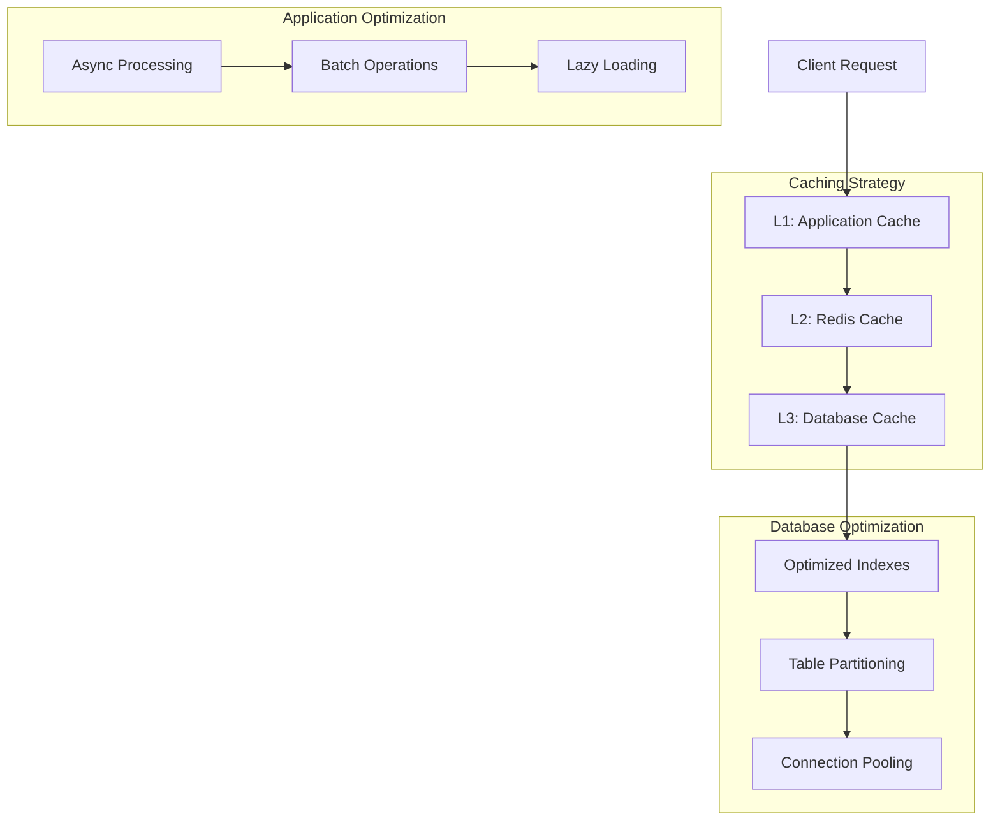

## Deployment Architecture

### Container Architecture

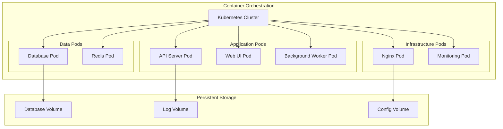

### Network Architecture

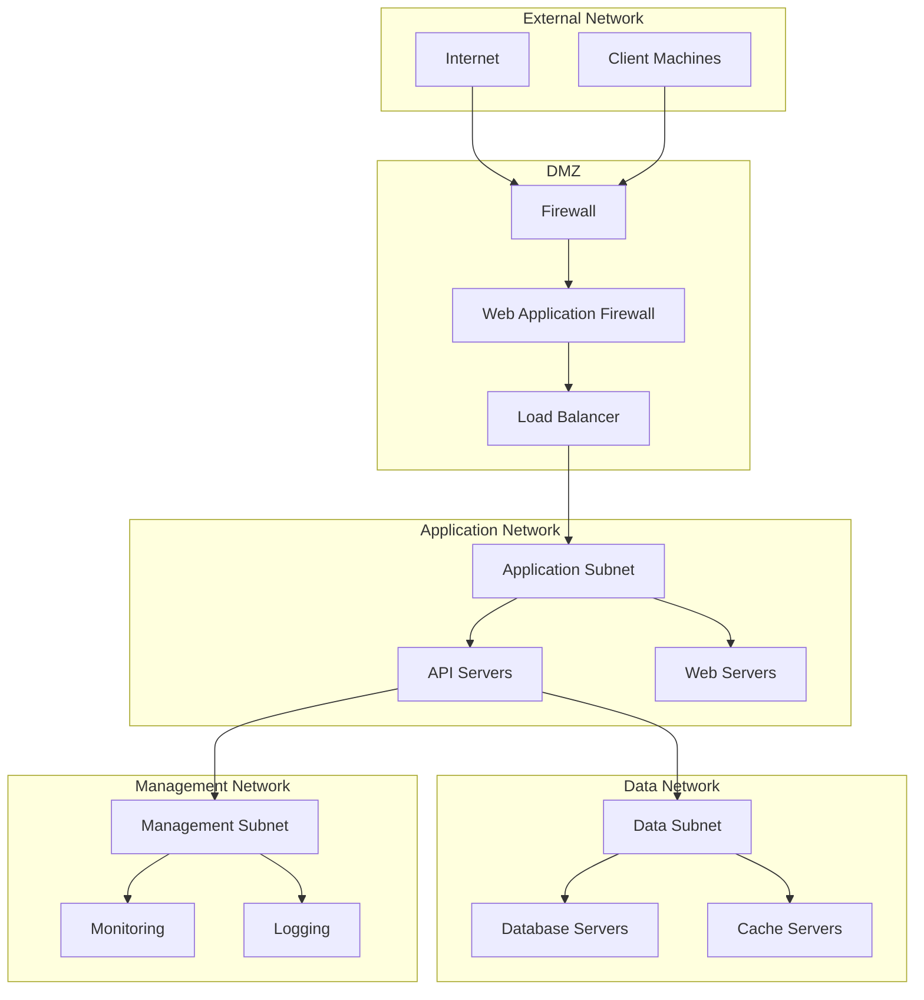

## Monitoring and Observability

### Monitoring Architecture

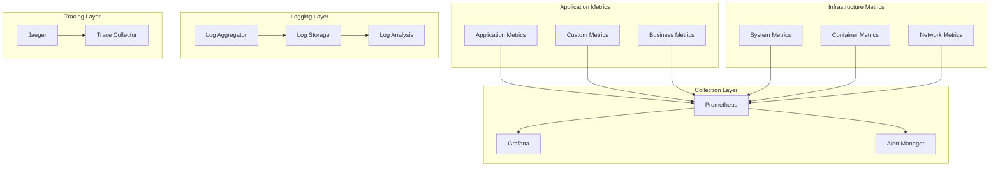

### Health Check Architecture

```mermaid
graph LR
    subgraph "Health Checks"
        LIVENESS[Liveness Probe]
        READINESS[Readiness Probe]
        STARTUP[Startup Probe]
    end
    
    subgraph "Health Endpoints"
        HEALTH_API[/health/live]
        READY_API[/health/ready]
        METRICS_API[/metrics]
    end
    
    subgraph "Dependencies"
        DB_CHECK[Database Check]
        CACHE_CHECK[Cache Check]
        EXTERNAL_CHECK[External Service Check]
    end
    
    LIVENESS --> HEALTH_API
    READINESS --> READY_API
    STARTUP --> HEALTH_API
    
    HEALTH_API --> DB_CHECK
    READY_API --> CACHE_CHECK
    READY_API --> EXTERNAL_CHECK
```

## Design Patterns and Principles

### Architectural Patterns

1. **Layered Architecture**: Clear separation between presentation, business, and data layers
2. **Microservices**: Modular services with well-defined boundaries
3. **Event-Driven Architecture**: Asynchronous communication through events
4. **CQRS**: Command Query Responsibility Segregation for read/write operations
5. **Repository Pattern**: Abstraction layer for data access

### Design Principles

1. **Single Responsibility**: Each component has one reason to change
2. **Open/Closed**: Open for extension, closed for modification
3. **Dependency Inversion**: Depend on abstractions, not concretions
4. **Interface Segregation**: Many specific interfaces over one general interface
5. **Don't Repeat Yourself**: Avoid code duplication

### Error Handling Strategy

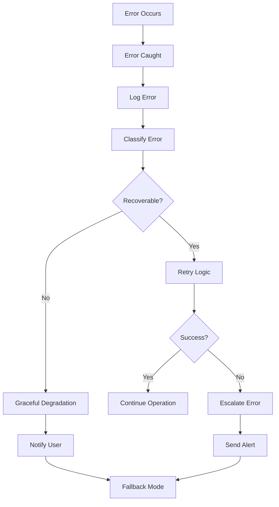

## Technology Stack

### Backend Technologies

- **Language**: Python 3.8+
- **Web Framework**: FastAPI/Flask
- **Database**: PostgreSQL/SQLite
- **Caching**: Redis
- **Task Queue**: Celery
- **Authentication**: JWT
- **API Documentation**: OpenAPI/Swagger

### Frontend Technologies

- **Framework**: React 18+
- **State Management**: Redux Toolkit
- **UI Components**: Material-UI/Tailwind CSS
- **Build Tool**: Vite
- **Testing**: Jest/React Testing Library

### Desktop Client Technologies

- **GUI Framework**: Qt6 (PyQt6/PySide6)
- **System Integration**: D-Bus, AppIndicator
- **Package Management**: Pacman integration
- **Configuration**: INI files

### Infrastructure Technologies

- **Containerization**: Docker
- **Orchestration**: Kubernetes/Docker Compose
- **Load Balancing**: Nginx/HAProxy
- **Monitoring**: Prometheus/Grafana
- **Logging**: ELK Stack/Loki
- **CI/CD**: GitHub Actions/GitLab CI

## Performance Characteristics

### Scalability Targets

- **Concurrent Users**: 1,000+ simultaneous connections
- **Endpoints**: 10,000+ registered endpoints
- **Pools**: 1,000+ package pools
- **Operations**: 100+ concurrent sync operations
- **Response Time**: <200ms for API calls
- **Throughput**: 1,000+ requests per second

### Resource Requirements

#### Server Requirements
- **CPU**: 2-8 cores depending on load
- **Memory**: 2-16GB depending on endpoint count
- **Storage**: 10GB+ for database and logs
- **Network**: 100Mbps+ for package transfers

#### Client Requirements
- **CPU**: 1 core minimum
- **Memory**: 256MB for client application
- **Storage**: 100MB for client installation
- **Network**: Broadband connection for sync operations

## Future Architecture Considerations

### Planned Enhancements

1. **Microservices Migration**: Break monolith into focused services
2. **Event Sourcing**: Implement event-driven state management
3. **GraphQL API**: Add GraphQL endpoint for flexible queries
4. **Real-time Collaboration**: WebSocket-based real-time updates
5. **Machine Learning**: Predictive sync scheduling and conflict resolution

### Scalability Roadmap

1. **Phase 1**: Horizontal scaling with load balancers
2. **Phase 2**: Database sharding and read replicas
3. **Phase 3**: Microservices architecture
4. **Phase 4**: Multi-region deployment
5. **Phase 5**: Edge computing integration

## Conclusion

The Pacman Sync Utility architecture is designed to be:

- **Scalable**: Handle growth in users and data
- **Reliable**: Maintain high availability and data consistency
- **Secure**: Protect against threats and unauthorized access
- **Maintainable**: Enable easy updates and feature additions
- **Performant**: Deliver fast response times and high throughput

This architecture provides a solid foundation for the current requirements while allowing for future growth and enhancement.

## Next Steps

To understand the architecture better:

1. Review [Database Schema](database-schema.md) for data model details
2. Check [API Documentation](api-documentation.md) for interface specifications
3. Study [Development Setup](development-setup.md) for implementation details
4. Examine [Configuration Guide](configuration.md) for deployment options